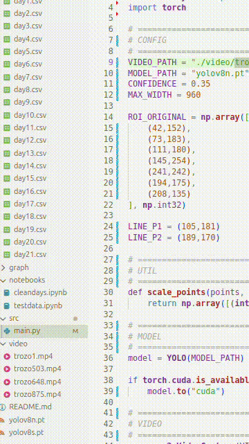
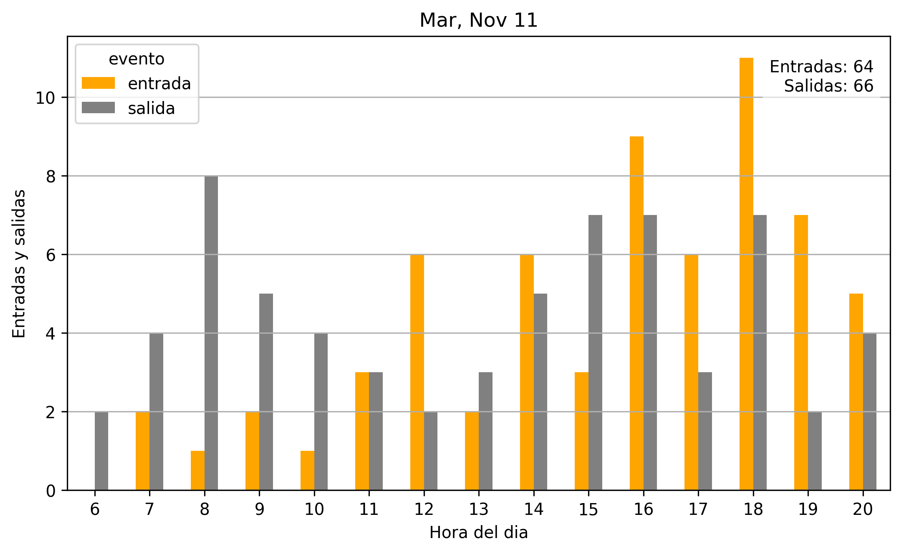

# Conteo de entrada y salida de vehiculos

---

# Description
Se recopilaran datos de un estacionamiento residencial con el fin de registrar entradas y salidas diarias desde las 6:00 hasta las 21:00 durante el mes de Noviembre. El objetivo es determinar a que horas hay mas entrada y salida de vehiculos y finalmente que dias la gente usa mas y que dias usa menos sus autos.
El sistema analiza grabaciones en formato .mp4 provenientes de una cámara IP. 
El enfoque del proyecto es simple y directo: usar un único ROI (Región de Interés) para identificar el movimiento de vehículos y su dirección, sin depender de otros elementos del entorno.

Se buscan responder 4 preguntas al finalizar estre proyecto
1. A que hora salen mas autos?
2. A que hora entran mas autos?
3. Que dias salen mas autos?
4. Que dias salen menos autos?

---

## Tecnologias utilizadas
- Python 3.10
- OpenCV
- YOLOv8 (Ultralytics)
- ByteTrack
- Pandas / NumPy
- Matplotlib
- Jupyter Notebook

---

# Objetivos
- Detectar vehículos dentro de un área específica del video (ROI).
- Determinar si un vehículo está entrando o saliendo.
- Registrar fecha y hora de cada evento.
- Generar estadísticas diarias de entradas y salidas.

---

# Flujo de trabajo
Se usaran archivos .mp4 de la camara (no en vivo para este proyecto)
Para detectar esto se tomara 1 criterio.
El Area solo registrara el cuadrante interior(Estacionamiento)
Si es hacia afuera entonces Salidas +=1
Si es hacia adentro entonces Entradas +=1

---

# Datos Importantes
Dia
Salidas y entradas totales del dia
Distribucion de entradas y salidas cada 1 horas ambas variables diferenciadas por color
15 Horas Diarias (6:00 - 21:00) (Distribuir en eje X)

---

# Resultados
Resultados finales
[`resumen_diario.csv`](data/clean/resumen_diario.csv)
En base a los datos aqui mostrados, podemos concluir lo siguiente:

1. Los dias que mayor entrada y salida de vehiculos hay es dentro de la semana (Lunes - Viernes). 
2. El pico de hora de salida es a las 7:00. Eso coincide con las horas de entrada al trabajo. Y el pico de horas de entrada es dentro de las 18:00 y 19:00. Lo que tambien coincide con los horarios laborales regulares.
3. Los dias que menor entrada y salida de vehiculos son los dias sabado y domingo.
4. Las entradas son proporcionales a las salidas.
5. Los dias de la semana varian mucho en cuanto a salidas y entradas entre si, pero parece ser una coincidencia mas que una causa directa de algo. La cantidad de datos disponible no permite extraer conclusiones firmes en este aspecto.
6. El martes 11 de noviembre, único día con condiciones de lluvia durante el período analizado, y fue el dia que mas salidas registra, pero faltan mas datos para resultados concluyentes.

---

Hardware:
Gpu Nvidia con tecnologia CUDA (para procesado de videos mas rapido)
Camara IP